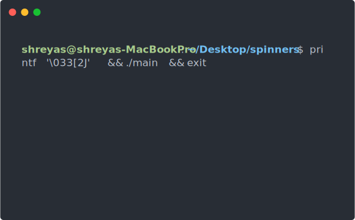

# Terminal Spinners in Vlang
[](https://www.codacy.com/gh/rhygg/spinners/dashboard?utm_source=github.com&amp;utm_medium=referral&amp;utm_content=rhygg/spinners&amp;utm_campaign=Badge_Grade)

`spinners` is a cross-platform V library written in C and V to create spinner animations in your terminal. Useful for creating CLIs in V. Sample output:



## Installation
With the **default** v cli:
```bash
v install --git https://github.com/rhygg/spinners
```
or with [vpkg](https://vpkg-project.github.io/):
```bash
vpkg get spinners
```
### Quick example
```v
import spinners { Spinner }
import time

fn main() {
    mut sp := Spinner{}
    sp.start("please wait...") ?
    
    time.sleep(1000 * time.millisecond)
    
    sp.stop()
    println("done!")
}
```
### Other default animation types
```v
import spinners { Spinner, AnimationType }
import time

fn main() {
    mut sp := Spinner {
        animation: AnimationType.simple_dots
    }
    
    sp.start("please wait...") ?
    
    time.sleep(3000 * time.millisecond)
    
    // you can change text while it's running!
    sp.set_text("almost there! hang tight...")
    
    time.sleep(1000 * time.millisecond)
    
    sp.stop()
    println("done!")
}
```
### Customizing it's frames and interval
```v
import spinners { Spinner }
import time

fn main() {
    mut sp := Spinner {
        frames: [ 'a', 'b', 'c', 'd' ] // string length must be consistent
        interval: 80 // in ms
    }
    
    sp.start("please wait...") ?
    
    time.sleep(1000 * time.millisecond)
    
    sp.stop()
    println("done!")
}
```
### Adding colors to the spinner
```v
import spinners { Spinner, Color }
import time

fn main() {
    mut sp := Spinner {
        color: Color.magenta
    }

    sp.start("please wait...")
    time.sleep(1000 * time.millisecond)
    
    sp.stop()
    println("done!")
}
```
### Spinner with custom messages
```v 
import spinners { Spinner, Color }
import time

fn main() {
    mut sp := Spinner {
        color: Color.magenta
    }

    sp.start("please wait...") ?
    time.sleep(1000 * time.millisecond)
    
    // instead of stop we can use success, warning, error, or info. 
    // sends a success message
    sp.success("done!")
    
    // sends an error message
    sp.error("error!")

    // sends a warning message
    sp.warning("warning!")

    // sends a info message
    sp.info("info!")
}
```
